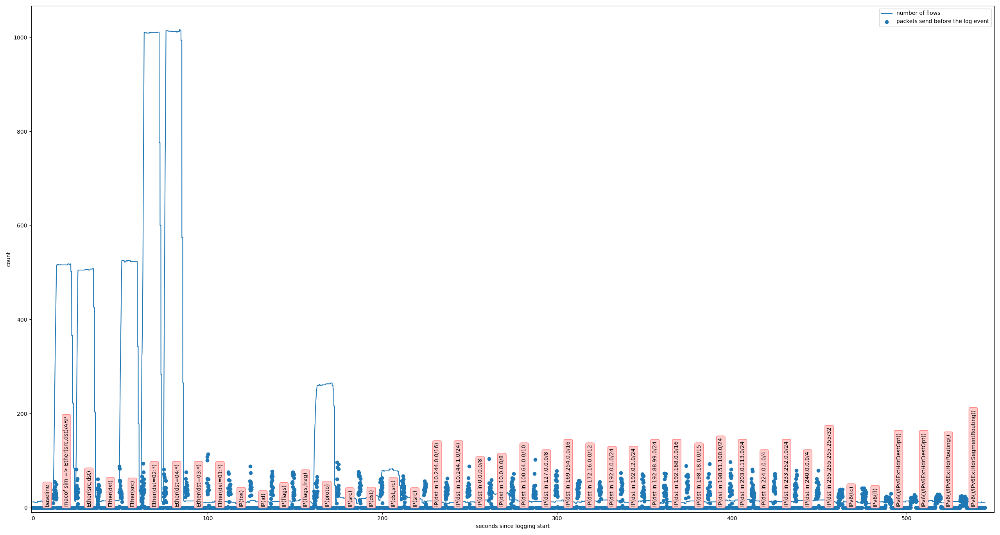

# Measuring which packets generate flow rules

## Experiment description

While recording all packets by `tcpdump`, we send hand-crafted randomized packets in batches of 1000 using raw sockets and `scapy`. Between the batches, we wait long enough so that all flow rules from previous batch are evicted before the next one runs. Both of these are run inside a pod in a Kubernetes cluster.

In parallel, we monitor the number of flow rules installed in the pod's node's kernel (the logs are sent using UDP to the pod, so that they are logged by `tcpdump`).

Reasonably readable description of the packet sending procedure can be read in [the source code](../src/experiments/packet_fuzzing.py).

## Results

