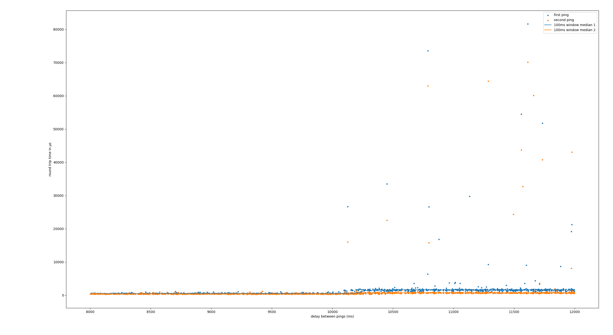
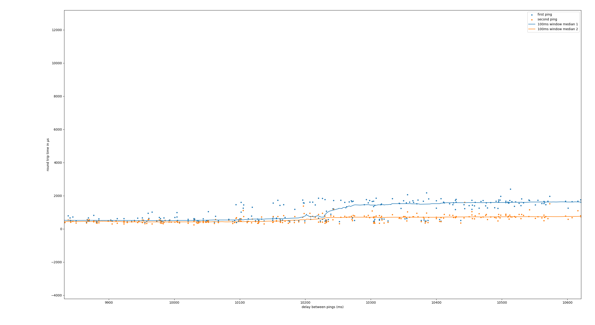

# Measuring flow rule eviction timeout

## Experiment description

We measure latency by using ICMP ECHO requsts in an (infinite) loop from a pod within Kubernetes using this pattern:

```

<---||------ random delay ----------||---- random delay ---||---->
   ^^                              ^^
    |---- two consecutive pings  --|
```

We collect samples with the following data:
- duration of the delay
- rtt of first ICMP ECHO request
- rtt of second ICMP ECHO request


## Data analysis

We plot the latencies against delay duration and look for patterns. We expect that there will be a jump in measured latencies of the first echo request.


## Results


