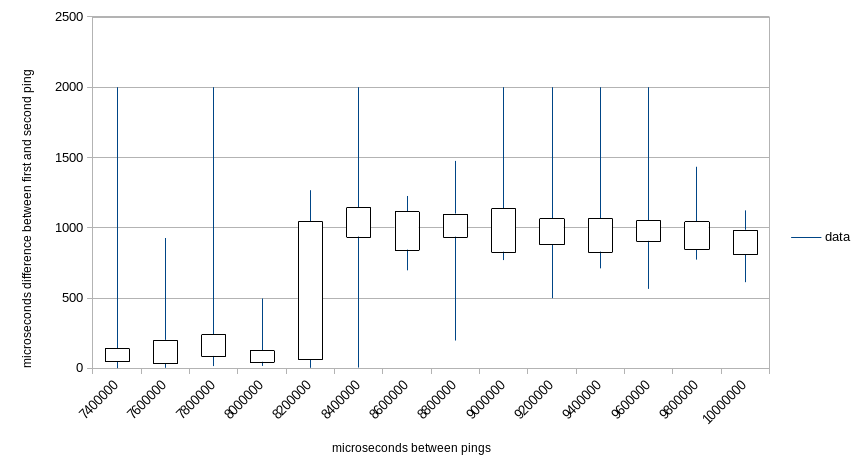

# Analyser

Measures difference between latency of consecutive ICMP pings to 192.168.1.1 (currently hard-coded).

## Usage

Command like this will produce data used to create the graph bellow.

```
./analyser --samples 20 --delay-step-ms 200 --delay-first-ms 7400 --delay-stop-ms 10000
```

## Results

Results from Kubernetes cluster at home:



The plot shows min, max and quartiles of the latencies measured.

